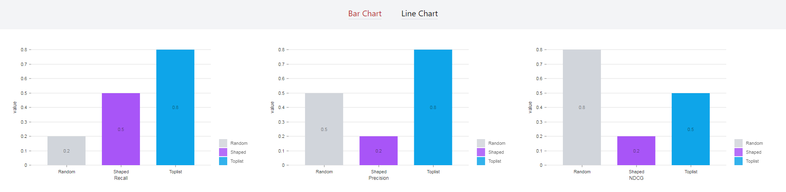

## Implementation of BarChart and LineChart using Nivo Chart library

Next.js project with Nivo charts ready for use.

To run it

Install dependencies

```bash
npm install
```

Start the development server

```bash
npm run dev
# or
yarn dev
```

Open [http://localhost:3000/barchart](http://localhost:3000/barchart) or [http://localhost:3000/linechart](http://localhost:3000/linechart) with your browser to see the charts.

### BarChart



### LineChart


